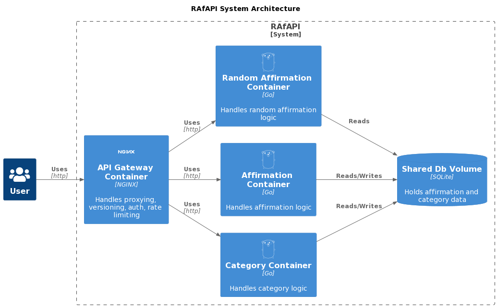
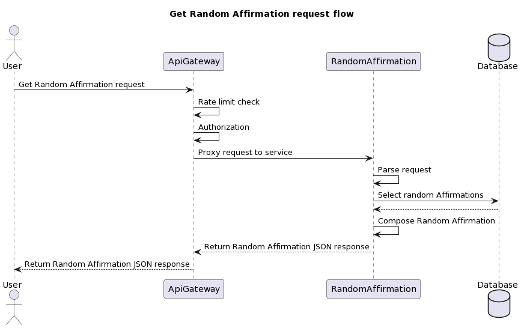

## RAFAPI

1. [What is RAfAPI](#what-is-rafapi)
2. [Features](#features)
3. [Architecture](#architecture)
4. [How to use RAfAPI](#how-to-use-rafapi)
5. [Repository directory structure](#repository-directory-structure)
6. [Roadmap](#roadmap)

### What is RAfAPI

☝️ RAfAPI is a small hobby project I’ve been building in order to practice Go. Initially I wanted to create a simple app offering daily random affirmations ✨. The idea was quickly refined into a set of APIs serving random affirmations with content management features. Oh and RAfAPI stands for **R**andom **AF**firmation **API**. 😜

The **Random Affirmation** is a piece of text served to the user, which is composed of individual affirmative sentences (**Affirmations**) belonging to different **Categories** (health, love etc.) It’s possible to fetch the text in two ways. If no category ids are specified in the request, the text is composed of 10 random sentences, each from a different category. If the user specifies the desired category ids, the result contains one random sentence from each given category. 

🛠 Some of the applied concepts/methodologies/tech:  
Microservices, Containerization, Docker/Compose/BuildKit, Multi-stage build, Domain Driven Design, Clean Architecture, Dependency Injection, REST, OpenAPI/Swagger, API-first development, Automated testing (unit/integration/API/end-to-end, blackbox), Mocking, API Gateway, API key authentication, Rate limiting, Leaky Bucket,  ULID, Continuous Integration, Static analysis/Linting, Cross-compilation, CGo, Make, Bash scripting

### Features

☝️ The project was developed with the **API-first** approach. As I expanded the initial idea into "business" requirements I created an **OpenAPI 3.0** (f.k.a. **Swagger**) specification to describe the available features and behaviour. It served as a blueprint for the actual development however it was also slightly updated along the way. In the real world the server/client code is often automatically generated from the OpenAPI spec though for the purpose of practicing Go I built everything by hand. After the API Gateway was introduced, a new updated API specification (version 2.0.0) was created to depict the extended behavior (versioning, auth, rate limiting etc.).

There are three REST APIs available:   
**Random Affirmation API** - serves the main functionality (get)     
**Affirmation API** - allows for managing the affirmation sentences (list, get, create, update, delete)    
**Category API** - allows for managing the affirmation categories (list, get, create, update, delete)  

Check the current (API Gateway) specification here: [openapi-rafapi-2.0.0.yml](api/openapi-rafapi-2.0.0.yml). You can also check the original (blueprint) spec here [openapi-rafapi-1.0.0.yml](api/openapi-rafapi-1.0.0.yml).

👀 It's possible the explore the visual representation of the spec in a nice and interactive way by using the public **Swagger UI**: [explore openapi-rafapi-2.0.0.yml in Swagger UI](https://petstore.swagger.io/?url=https://raw.githubusercontent.com/Gadoma/RAfAPI/main/api/openapi-rafapi-2.0.0.yml)

### Architecture

☝️ The whole application is **decomposed by subdomain** into three distinct microservices (`randomAffirmation`, `affirmation`, `category`), each serving a single API. The services are separate Go applications in form of Go modules. There is a fourth Go module `common` which is not executable and contains common parts used by the other three modules (main app logic, http and database handling, errors).

Each service adopts a layered architecture (`domain`, `application`, `infrastructure` layers) inspired by **Domain Driven Design** and **Clean Architecture** by Uncle Bob.

🗄 The database is shared across all three services and consists of a single SQLite file. Universally Unique Lexicographically Sortable Identifiers (ULIDs) are used as IDs (and database table primary keys). The ID generation process is **decoupled from the database** and occurs in the `infrastructure` layer (as ULID depends on time).

The application uses minimal dependencies:  
- [github.com/gorilla/mux](https://github.com/gorilla/mux)  
- [github.com/oklog/ulid](https://github.com/oklog/ulid)  
- [github.com/mattn/go-sqlite3](https://github.com/mattn/go-sqlite3)  

The microservices are containerized via Docker on a **service-per-container** basis. There are five abstract services described using Compose specification: `random_affirmations`, `affirmations`, `categories`, `api_gateway` and `linter` (described later). The image versions are pinned to achieve **reproducible builds**. The containers are built via BuildKit **multistage builds**. As I work on a MacBook with MacOS on ARM64 architecture the builds involve **cross-compilation** to AMD64 architecture (to run on linux/amd64). This includes CGo, required for Go's SQLite bindings. Configuration is passed to the Go services through ENV variables.

The `api_gateway` is an NGINX instance operating as a **reverse proxy** and providing additional functionality such as API versioning, authorization via x-api-key header and request rate limiting (separate for authenticated and unauthenticated requests; via **Leaky Bucket** algorithm). 

Additionally the gateway masks all 404 responses as 400 to **prevent rogue endpoint discovery**/traversal. It is also capable of masking the detailed application error messages returned by default from the services with generic messages. The latter feature is currently turned off for development and educational purposes therefore the inner details are visible when something goes wrong.

### Continuous Integration

☝️ The services contain various automated tests written in **blackbox style**. Each service includes a full end-to-end API test suite which covers all endpoints, both **happy paths** as well as error scenarios. Additionally there are unit tests that use **mocks** as well as integration tests that work with the database. 

The code passes a pretty extensive **static analysis/linting** pipeline driven by golangci-lint which currently consists of 27 various linters.

The project has a CI workflow setup executed via **Github Actions** which covers building (compilation), running the tests and linting (static analysis). 

Additionally there is a local linting stack ran in a dedicated container (the `linter` service). In any case the golangci-lint version is pinned to v1.50.0 for reproducible results. 

### How to use RAfAPI

☝️ For convenience there is a **Makefile** wrapping the most common tasks which are carried out by individual **Bash scripts**. The following Make targets are supported:

- **go-build** - run compilation  
- **go-test** - run tests  
- **go-lint** - run static analysis  
- **docker-build** - build the app containers  
- **docker-start** - start the app containers  
- **docker-stop** - stop the app containers  
- **curl** - test the running app via curl  
- **list** - list available commands  
- **all** - run the build pipeline and start the app. 

🚀 To start the application just checkout the repository and run `make start`. If you additionally want to run the CI pipeline, run `make all`. In any case, this should build and start all of the services in their respective containers. Once the containers are up and running you can use Postman or cURL to send requests to the API. 

Remember to include the `x-api-key` header with a correct api key. You can find examples in the NGINX config at [docker/api_gateway/secrets/api_keys.conf](docker/api_gateway/secrets/api_keys.conf) (normally the **api keys should never land in the repository** but as this is a training project, they are included therein for testing purposes). 

To make local testing easier there is a dedicated make target for running a few requests against the APIs on localhost: `make curl`. 

### Repository directory structure

This repository contains the following directories:

- **.github** - Github Actions workflow definitions
- **api** - OpenAPI specifications
- **db** - Database migrations/seeds and SQLite files
- **doc** - PlantUML diagram definitions and images
- **docker** - Dockerfiles and NGINX configuration files
- **internal** - Go source files
- **scripts** - Bash scripting

### Roadmap

☝️ Here are some next steps envisaged to make RAfAPI even better:  

1. Add an **SSL certificate** and switch to HTTPS-only traffic, for improved security.
2. Switch Secrets handling from Compose Secrets to **BuildKit Mount Secret**, for improved security.
3. Introduce caching via **BuildKit Mount Cache** for APT cache and Go package/build cache, for faster builds.
4. Prepare a set of fully-fledged **C4 model** architecture diagrams, for improved documentation.
5. Switch base images to **Alpine Linux** and use **MUSL** for cross-compilation, for smaller builds.
6. Introduce **HashiCorp Vault** service to manage secrets, for improved security.
7. Refactor the code to **Ports&Adapters** architecture with applied **CQRS**, for improved maintainability.

